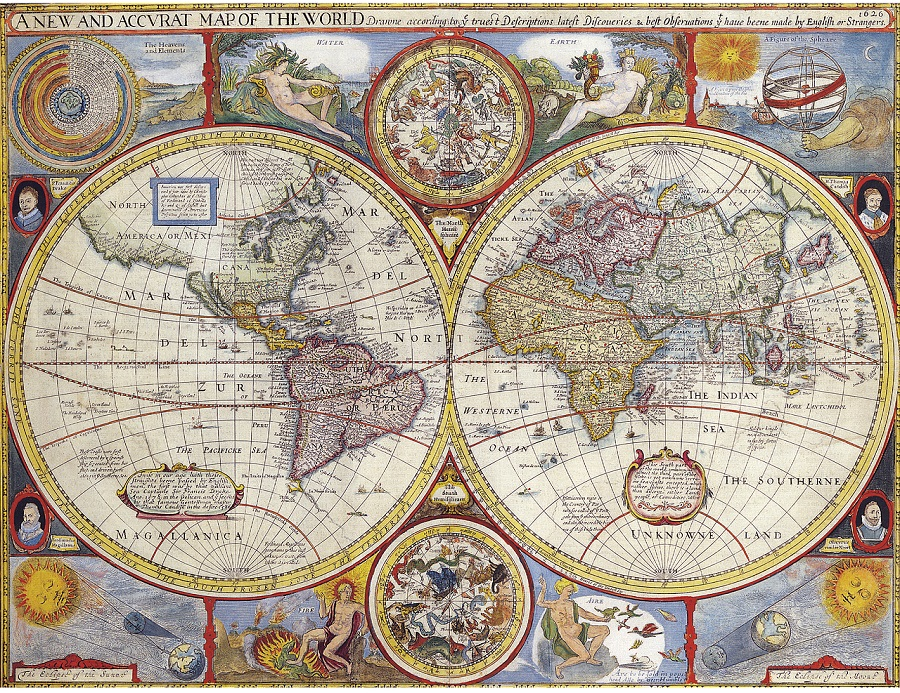

<head>
	<link rel="stylesheet" href="/home/mibanfi/Documents/Scuola/Default.css">
	
</head> 

#La tettonica delle placche
	Da pagina 108 in poi

La tettonica delle placche studia i movimenti delle placche di cui è composta la **crosta**.

##Gli strati della Terra

###Crosta
Un involucro rigido e (relativamente) sottile; lo spessore è variabile —ad esempio, la crosta oceanica è più sottile con solo 5-6km— ma è sempre molto minore rispetto agli strati inferiori.

####Discontinuità di Moho
Una discontinuità è un cambio di stato improvviso che separa due strati, in questo caso la crosta e il mantello.

###Mantello
Lo strato immediatamente inferiore alla crosta. Non è uniforme, bensì a sua volta diviso in varie parti:

* <b>Mantello superiore:</b> Semisolido. L'insieme di crosta e mantello superiore si chiama **litosfera**, poiché questi due sono prevalentemente solidi.
* <b>Astenosfera:</b> È liquida, quindi piena di **magma**.
* <b>Mantello inferiore:</b> Viene definito il "mantello vero e proprio". Qua i materiali tornano a essere solidi, ma a causa della <u>pressione</u>, non della temperatura.

####Discontinuità di Gutenberg
Non si tratta dello stesso Gutenberg che ha inventato la stampa a caratteri mobili.

###Nucleo
Anch'esso è solido a causa della pressione. Al suo interno sono ancora in corso processi di **decadimento nucleare** che liberano grandi quantità di energia e portano la temperatura a quelli che si stimano essere *6'000 °C*!

Siamo in grado di stimare lo stato dei materiali nelle profondità della Terra in base al modo in cui le <b>onde sismiche</b> li attraversano: i materiali liquidi le lasciano passare più facilmente.

##La crosta

<table class="vstable">
	<tr>
		<th class="vsth">Crosta oceanica</th>
		<th class="vs">VS</th>
		<th class="vsth">Crosta continentale</th>
	</tr>
	<tr>
	<td>Più densa e pesante (rocce magmatiche)</td>
	<td></td>
	<td>Meno densa e pesante (rocce sialiche)</td>
	</tr>
	<tr>
	<td>Più sottile</td>
	<td></td>
	<td>Meno sottile</td>
	</tr>
	<tr>
	<td>Più recente</td>
	<td></td>
	<td>Meno recente</td>
	</tr>
</table>

###L'isostasia
L'isostasia è un fenomeno che comporta il movimento verticale della litosfera, che "galleggia" sull'astenosfera come una zattera. Se una placca si appesantisce, sprofonda molto lentamente: si parla di pochi millimetri all'anno.  
Un esempio di isostasia sono le formazioni di grandi ghiacciai che "caricano" le catene montuose.

##Il flusso termico
Il nucleo, come abbiamo visto, genera calore tramite decadimento nucleare; questo calore si diffonde fino alla superficie terrestre, disperdendosi non omogeneamente a seconda delle condizioni del mantello superiore.

##Le placche litosferiche
La litosfera è costituita da 17-20 placche che galleggiano sull'astenosfera. Esse possono interagire avvicinandosi, allontanandosi o scorrendo e in base a questo vengono denominate **convergenti**, **divergenti** o **trasformi**; i vulcani si trovano spesso in corrispondenza di queste ultime. Le placche si possono inoltre distinguere tra **solo oceaniche**, **perlopiù continentali** o **miste** a seconda della loro composizione.

###La teoria di Wegener o della deriva dei continenti
Indizi per la teoria:
* La forma dell'Africa continentale combacia con quella del Sud America
* Sono stati trovati gli stessi fossili in continenti lontanissimi, ma solo tra quelli risalenti a più di 200 milioni di anni fa.

Da ciò Wegener ha dedotto che i continenti si sono allontanati e in un passato remoto erano tutti uniti a formare un unico grande continente, la **Pangea**. In futuro potrebbe venire sviluppata una nuova teoria, ma per ora questa è l'unica a spiegare certi fenomeni, tra cui appunto la questione dei fossili e la distribuzione dei vulcani. Questi ultimi infatti nascono naturalmente in corrispondenza della spaccatura tra due placche, anche se esistono dei **punti caldi** inel mezzo delle placche che danno comunque origine a fenomeni vulcanici. Gli atolli corallini, tra l'altro, si formano proprio in corrispondenza dei vulcani sommersi dall'oceano, e ospitano numerosi microrganismi che producono rocce coralline.

####La triade delle teorie della litosfera
* Teoria della tettonica a placche
* Teoria di Wegener o della deriva dei continenti
* Teoria della subduzione dei fondali oceanici

###I margini convergenti
Vi sono tre situazioni che possono verificarsi in corrispondenza di un margine convergente:
* Crosta continentale contro crosta continentale: avviene l'**orogenesi**. I margini si scontrano, sollevandosi e dando origine a una catena montuosa.
	* La **catena himalayana**, ad esempio, è tuttora in crescita orogenetica.
	* Affinché sul nuovo suolo si formi la terra, è necessario che prima arrivino gli **organismi pionieri**, minuscole forme di vita che fertilizzano l'area e consentono alle piante di nascere.
* Crosta oceanica contro crosta continentale: Siccome la crosta oceanica è più pesante, avviene la **subduzione**, che dà origine a una **fossa oceanica** e a una serie di vulcani nota come **arco magmatico**.
* Crosta oceanica contro crosta oceanica: avviene sempre la subduzione, dove la placca più pesante si inabissa sotto quella più leggera (la crosta oceanica, infatti, è troppo densa per causare orogenesi). In mancanza di terraferma, l'arco magmatico che si viene a formare è **insulare**.  

###I margini divergenti
	Vedere pagine 120-121

###I margini trasformi
Due lembi di litosfera che scorrono in direzioni opposte, o nella stessa direzione ma con velocità differenti, sono detti **trasformi**. Essi sono anche detti **conservativi** poiché non producono ne affondano porzioni di litosfera, ma la pressione causata dallo scorrimento genera **terremoti** e **rocce metamorfiche**.